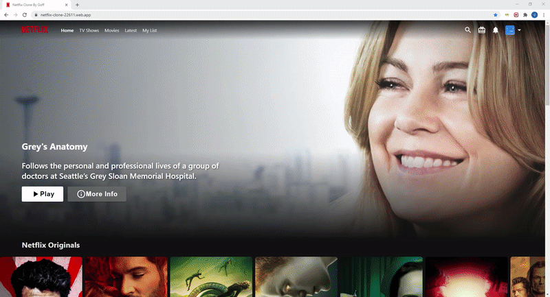
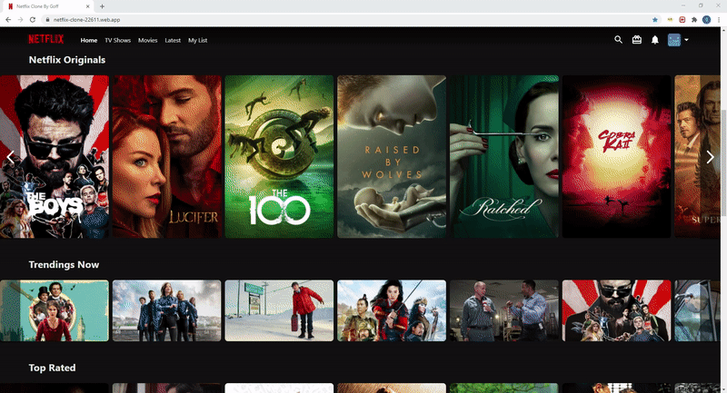

# React Netflix clone

## Project Description

The objective of this project is to build a React Netflix clone with the following features:

- Pull all movie infomration from TMDM API & Youtube
- Show Hero movie randomly for each refresh ()
- List all movies by category (ex. Netflix Original, Trending Now, Top Rated, Action, Horror)
- Show movie trailer when hover on movie poster (Grab movie trailer from Youtube)
- Show movie slider where you can click previous & next
- Full Responsive features fit to all screen sizes (As similar to Netflix as possible)

## 🖼️ Screenshot

## 🌐 [Live Preview](https://netflix-clone-22611.web.app//)

## 🛠️ Tech stack

In this project I used:

- React 16.3.1
- HTML5 and CSS3
- MaterialUI (for icon)
- Firebase (for hosting)
- TMDB API (for movie infomation)
- react-youtube (for youtube video play)
- movie-trailer (for retrive youtube trailer video by movie name)
- react-multi-carousel (for image gallory)

## 🧾 TODO

- When hover on movie poster, that poster must show on the top level (Problems with react-multi-carousel)
- When hover on movie poster also show other detail as following:
  - Movie rate (ex 13+, 18+)
  - Play button (Now autoplaying)
  - Add to My List, I like this, Not for me, More Info
  - Movie categories
- Change from banner hero image to hero video

## 🤝 Contributing

Contributions, issues and feature requests are welcome!

Feel free to check the [issues page](../../issues).

## ⭐️ Show your support

Give a ⭐️ if you like this project!

## 👨🏽‍💻 Authors

- [@goffjira](https://github.com/goffjira/)

## 📝 License

[MIT licensed](./LICENSE).
